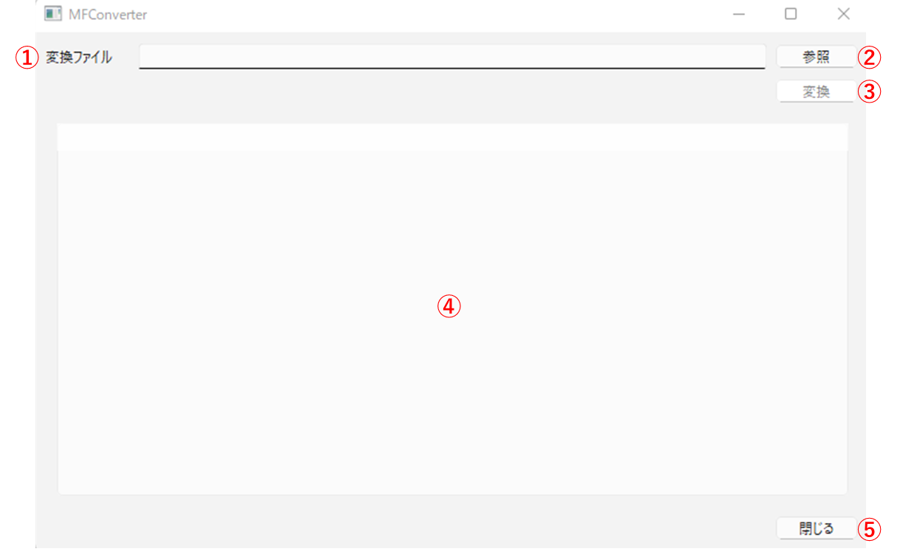
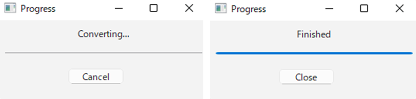

# 操作マニュアル

# 1 本書について

本書では、人流データ変換ツール（以下「本システム」という。）の操作手順について記載しています。

# 2 使い方

ファイル「MFConverterMain.exe」を実行すると以下の画面が表示されます。

① 変換ファイル

・読み込んだファイルの名前が表示されます。

② 参照

・クリックするとファイルダイアログが表示されます。

・ダイアログ内で選択されたファイルを変換元の人流データとして読み込みます。

③ 変換

・クリックすると、読み込んだ人流データを汎用フォーマット人流データに変換（※）します。

・変換された汎用フォーマット人流データは変換元のファイルと同じフォルダ内に出力されます。

④ 人流データ情報一覧

・読み込んだファイルに含まれている人流データに関する情報を一覧で表示します。

⑤ 閉じる

「MFConverterMain.exe」を終了します。

（※）変換中は以下の画面が表示されます。「Finished」というメッセージが表示されると変換完了となります。

# 3 出力データ

本システムで出力されるデータは以下のとおりです。

| 出力データ     | 内容                                                         | データ形式     |
| ------------- | ------------------------------------------------------------ | ------------- |
| 変換人流データ | 読み込んだ人流データを汎用フォーマット人流データに変換したデータ。 | JSON          |
